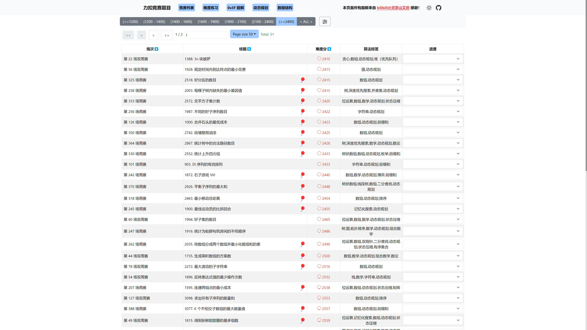

# LC-Rating

  
  
  
  

## 介绍
本项目基于[灵茶山艾府](https://leetcode.cn/u/endlesscheng/)的文章[如何科学刷题？](https://leetcode.cn/circle/discuss/RvFUtj/)而构建的一个刷题用网站。 主要使用 **[React](https://react.dev/)** + **[NextJS](https://nextjs.org/)** 构建。

## 特性和使用方法
本项目有4种使用方法:
1. 力扣竞赛题目列表，含分数展示，可以让想自己mock contest的用户快速直达并了解题目的难度
2. 难度训练，对不同难度的题目进行了划分，让用户更好的了解自己的水准。算法新手和老手想在力扣周赛上分的都可以使用此功能。此外还添加了进度标注，并可以对进度进行同步。
3. 题解搜索, 支持根据题目、题解标题、算法模板名称、标签等过滤，纯本地化+缓存优化，速度飞快。题解链接（来源：[@灵茶山艾府](https://space.bilibili.com/206214)）
4. 整合了灵茶山艾府列出的题单，标注了分数同时也添加了进度标注。用于突击训练特定知识点，掌握常用算法套路。

## Screenshot

  </img>
  </img>

## 数据来源
- 基础 - 【[leetcode.cn](https://leetcode.cn/)】
- 题目难度 - 【[leetcode_problem_rating](https://raw.githubusercontent.com/zerotrac/leetcode_problem_rating/main/data.json)】

